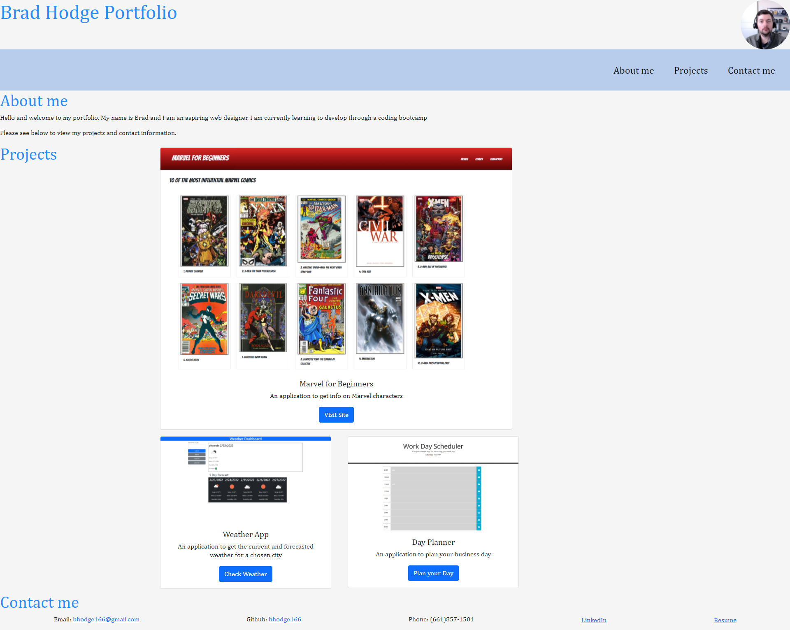

#Portfolio

This code is represents my initial portfolio page. It includes a small section about me, a project section which includes filler content for the time being, and my contact information. There is nav bar to scroll to the different sections.

The styling is done mostly through bootstrap.

Screenshot of finished work can be seen below:

The website is deployed here:
https://bhodge166.github.io/Portfolio/
